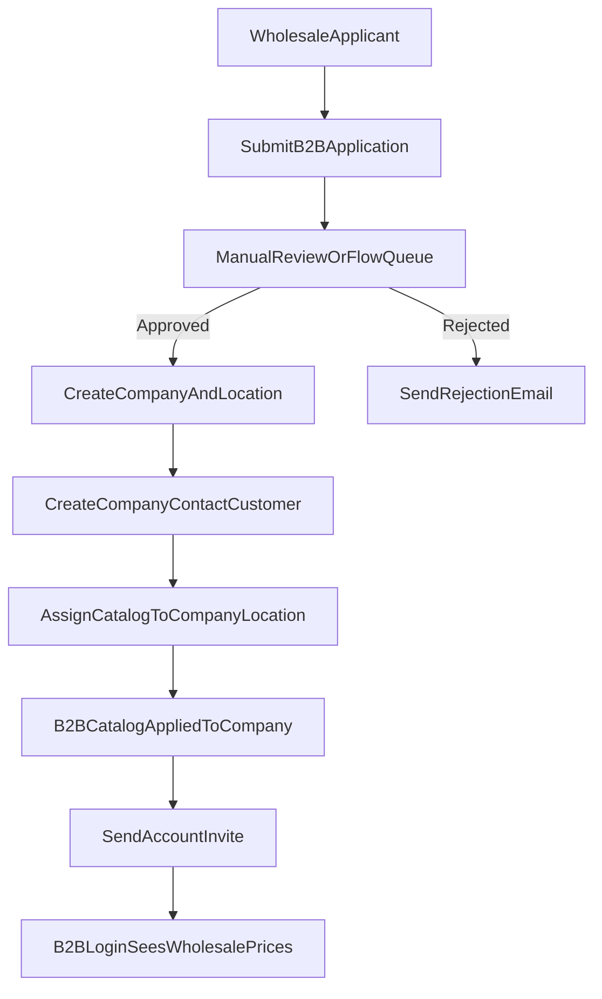

# Non-Plus B2B Registration and Catalog Plan

## Recommended Architecture

Use **one blended storefront** with two customer contexts:
- **Retail context:** normal customer accounts, retail pricing/catalog.
- **B2B context:** Shopify B2B company customers, B2B catalog pricing.

Because the store is **not on Plus**, use **B2B company + company-location catalog assignment** as the primary pricing segmentation method, with market catalogs as optional fallback segmentation.

## Capability Constraints (Important)

- Shopify B2B features are available on paid non-Plus plans, including companies and catalogs.
- Confirm current plan limits for total active catalog assignments and company-level assignments in your specific plan tier before go-live.
- **Direct company catalog assignment is available for your non-Plus setup**, so pricing can be mapped directly to company/company locations.
- Keep Shopify Markets configuration aligned so retail and B2B publishing behavior remains predictable.

## End-to-End Flow

## Registration Page Suggestions

Create a dedicated page like `/pages/wholesale-registration` with:
- Business fields: company legal name, trade license/VAT/TRN, billing/shipping addresses.
- Buyer/contact fields: full name, work email, phone, role.
- Commercial fields: expected monthly volume, product categories, requested payment terms.
- Compliance upload: trade license/reseller certificate (file upload).
- Consent: terms, privacy, pricing policy acknowledgment.

Store submissions in either:
- App backend DB (best for review workflows), or
- Shopify customer/metafields + admin tags (lighter setup).

## Approval Workflow

## 1) Intake state
- Mark each applicant with statuses: `new`, `in_review`, `approved`, `rejected`, `on_hold`.

## 2) Approval action
On approval, automate these steps:
- Create company + company location.
- Create/attach customer as company contact.
- Set B2B eligibility tags/metafields.
- Assign the B2B catalog directly to company location.
- Trigger account invite/welcome email.

## 3) Rejection action
- Send rejection email with optional reason.
- Keep record for audit + possible reapply flow.

## Catalog and Pricing Model

- Keep **Retail catalog** as default storefront.
- Create **B2B catalog** in Markets > Catalogs with wholesale prices.
- Assign this catalog directly to **company location** (primary path).
- Optionally keep market-level catalog rules for geo/channel segmentation where needed.
- Optionally use quantity rules/volume breaks for wholesale tiers.
- Use product publishing rules so B2B-only SKUs are hidden from retail.

## Theme / UX Behavior

- Show a “Wholesale apply” CTA in header/footer/account area.
- Add clear split CTAs on login/register:
  - `Retail sign up`
  - `Wholesale sign up`
- For logged-in B2B customers, show:
  - MOQ/pack-size messaging
  - case-pack increments
  - lead times and wholesale shipping policy

## Key Flows Commonly Missed

- Tax handling per B2B customer (VAT/TRN capture and exemption logic).
- Credit/payment policy (net terms approval policy and overdue handling).
- Address and multi-buyer permissions per company location.
- Fraud/risk checks for first wholesale orders.
- ERP/accounting sync for company records and receivables.
- Re-approval path when company details change.
- Offboarding/suspension flow if account becomes delinquent.

## Operational Guardrails

- Keep a manual override in admin for pricing and eligibility.
- Add audit logs for approval decisions.
- Add SLA targets (e.g., review applications within 24 business hours).
- Add fallback behavior when B2B context fails (default to retail pricing, no checkout break).

## Suggested Build Phases

1. Configure B2B catalog + sample company/customer and assign catalog to company location.
2. Build wholesale registration page and submission storage.
3. Build admin approval queue and approve/reject actions.
4. Automate company/customer provisioning + invite.
5. Add theme/account gating and B2B UX hints.
6. Run UAT for retail vs B2B pricing separation and checkout.
7. Go-live with monitoring and rollback checklist.

## No-App Implementation Option (Native Shopify First)

This option avoids third-party wholesale apps and custom backend services. It uses Shopify admin, customer accounts, company objects, catalogs, and optional Shopify Flow automations.

### What "No-App" Includes

- Separate wholesale registration page in theme (`/pages/wholesale-registration`).
- Form posts into Shopify native objects (customer + tags + notes/metafields strategy).
- Manual approval in admin (with optional Flow-assisted notifications).
- On approval, admin creates company/company location, links customer contact, and assigns B2B catalog.
- Customer gets account invite and logs in to see wholesale catalog/pricing.

### Setup Steps (No-App)

1. **Create B2B catalog**
   - In admin, create `Wholesale Catalog`.
   - Include/exclude products and set wholesale prices.
   - Add MOQ/quantity rules where needed.

2. **Create wholesale registration page**
   - Add a dedicated page template with fields:
     - company name, tax ID/VAT/TRN
     - buyer name, email, phone
     - address and business type
   - On submit, create a customer record with:
     - tag `wholesale_applied`
     - note or metafield storing submitted business details

3. **Admin review process**
   - Staff filters customers by `wholesale_applied`.
   - Validate business documents/details externally (email/phone/manual verification).
   - Move status using tags:
     - `wholesale_in_review`
     - `wholesale_approved`
     - `wholesale_rejected`

4. **Approval actions in admin**
   - Create company + company location.
   - Add the approved customer as company contact.
   - Assign `Wholesale Catalog` to the company location.
   - Remove pending tags and keep `wholesale_approved`.
   - Send account invite/reset password mail.

5. **Storefront behavior**
   - Keep retail as default experience.
   - Show “Apply for Wholesale” CTA on login/account/footer.
   - Optional: show wholesale-only navigation links only for approved B2B users.

6. **Operations and support**
   - Keep SOP for approval SLA (for example 24 business hours).
   - Use saved admin views for pending/approved/rejected applicants.
   - Maintain simple rejection/reapply email templates.

### Optional Native Automations (Still No-App)

- Use Shopify Flow to:
  - notify staff when `wholesale_applied` tag is added,
  - notify applicant when status tag changes,
  - create internal tasks/checklists for approval.

### Trade-Offs of No-App Approach

- **Pros**
  - Fastest and lowest-cost path.
  - Minimal maintenance and low technical risk.
  - Uses native Shopify B2B data model (companies/catalogs/customers).

- **Cons**
  - Approval remains partly manual.
  - Limited validation workflow and document management.
  - Less auditability and reporting versus custom app backend.
  - Harder to scale if applicant volume grows quickly.

### When to Upgrade Beyond No-App

Move to a custom app/workflow when you need:
- document upload + verification pipeline,
- role-based internal approval queues,
- ERP/CRM sync on approval,
- automated company creation with zero manual admin steps,
- advanced reporting on wholesale funnel conversion.

## Wholesale Registration Form Spec (No-App)

Use a single-page form at `/pages/wholesale-registration` and mark required fields clearly.

### Section A: Business Information

- Legal company name (required)
- Trading name / DBA (optional)
- Business type (required; distributor, restaurant, cafe, hotel, retailer, other)
- Tax registration number / VAT / TRN (required)
- Country of registration (required)
- Website or social profile (optional)

### Section B: Primary Buyer Contact

- First name (required)
- Last name (required)
- Work email (required; unique)
- Mobile number with country code (required)
- Job title/role (required)

### Section C: Purchasing Profile

- Interested categories (required; multi-select)
- Expected monthly order value (required; range select)
- Typical order frequency (required; weekly/biweekly/monthly)
- Preferred payment method (required; card/bank transfer/net terms request)
- Requested payment terms (optional; Net 7/15/30)

### Section D: Address and Logistics

- Billing address line 1 (required)
- Billing address line 2 (optional)
- City (required)
- Emirate/State (required)
- Postal code (optional if not used operationally)
- Delivery address same as billing (checkbox)
- Delivery address fields (required when checkbox is false)

### Section E: Compliance and Consent

- Trade license number (required)
- Trade license expiry date (required)
- Resale certificate available (yes/no; optional depending policy)
- Accept wholesale terms (required checkbox)
- Accept privacy policy (required checkbox)
- Marketing opt-in (optional checkbox)

### Hidden/Operational Fields

- Source page URL
- UTM source/medium/campaign
- Submitted timestamp
- Fraud honeypot field

### Validation Rules

- Block generic emails if desired (`gmail`, `yahoo`, etc.) with soft warning only.
- Enforce E.164 phone formatting where possible.
- Require VAT/TRN format checks for UAE if policy requires.
- Prevent duplicate submissions by same email within cooldown window (for example 24h).

### Customer Record Mapping (No-App)

On submit, create/update customer with:
- tags: `wholesale_applied`, `wholesale_new`
- note: serialized application snapshot (short form)
- optional customer metafields for structured data:
  - `b2b.company_name`
  - `b2b.tax_id`
  - `b2b.business_type`
  - `b2b.status` (`new`, `in_review`, `approved`, `rejected`)
  - `b2b.last_reviewed_at`

## Admin SOP (Daily Operations)

This SOP is for a no-app team process and can run entirely from Shopify admin + email.

### 1) Intake Triage (2-3 times/day)

- Open saved customer view filtered by tag `wholesale_applied`.
- Move each new record to `wholesale_in_review`.
- Verify required fields completeness.
- If incomplete, send “Need more info” template and tag `wholesale_on_hold`.

### 2) Verification Checklist

- Validate business legitimacy (license lookup/manual review).
- Validate contact identity (email domain/phone callback if needed).
- Validate tax details (TRN/VAT format and internal policy).
- Assess expected volume and fit with wholesale terms.

### 3) Approve Workflow

- Create company and company location in admin.
- Add customer as company contact.
- Assign `Wholesale Catalog` to company location.
- Set payment terms per policy (or keep prepaid initially).
- Update tags/metafields:
  - remove: `wholesale_applied`, `wholesale_in_review`, `wholesale_on_hold`
  - add: `wholesale_approved`
  - set `b2b.status=approved`
- Send approval + account activation email template.

### 4) Reject Workflow

- Update tags/metafields:
  - remove: `wholesale_in_review`
  - add: `wholesale_rejected`
  - set `b2b.status=rejected`
- Send polite rejection template (with reapply path if allowed).
- Log internal rejection reason in staff notes.

### 5) Reapply Workflow

- If rejected lead reapplies, tag `wholesale_reapplied`.
- Reopen review only after missing evidence is provided.
- Keep prior decision notes for audit trail.

### 6) Weekly QA Checklist

- Test one retail account and one approved wholesale account:
  - product visibility
  - price visibility
  - cart pricing
  - checkout pricing
- Validate newly approved accounts are linked to correct company location and catalog.
- Audit overdue `wholesale_in_review` records older than SLA.

### 7) SLA and Ownership

- Target first response: within 1 business day.
- Target final decision: within 2-3 business days.
- Assign named owner roles:
  - Sales ops: verification and decision
  - Admin ops: company/catalog mapping
  - Support: customer communication

## Ready-to-Use Email Template Subjects

- Application received: `Your Foodlink UAE wholesale application is received`
- More information required: `Additional details needed for your wholesale application`
- Approved: `Your wholesale account is approved - activate your account`
- Rejected: `Update on your wholesale account application`

## Pack Quantity, Pricing, Inventory, and Returns (B2B)

Requirement: for B2B, quantity `1` means a pack of `n` pieces, and shown price should be `unit_price x n`.

### Recommended No-App Model (Operationally Safe)

Use **separate B2B pack variants/SKUs** for each wholesale product:
- Retail SKU sells per piece.
- B2B SKU sells per pack (for example pack of 6, pack of 12).
- Catalog assigns B2B prices on pack SKUs only.

This keeps Shopify-native inventory behavior predictable without custom code.

### Pricing Display Rules

- Store pack size in variant metafield (for example `custom.pack_size`).
- Compute and display messaging on PDP/PLP for B2B users:
  - `Pack of n`
  - `Price per pack = unit_price x n` (display formula text or computed value).
- Checkout line price remains variant price (pack price), which avoids mismatch with order totals.

### Inventory Rules

- For B2B pack SKU, Shopify decrements **1 pack unit** when quantity 1 is ordered.
- To align with piece-level planning, operations should maintain conversion:
  - `available_pieces = pack_inventory x pack_size`.
- If a single shared piece pool is mandatory across retail + B2B in real time, that requires custom automation/app logic beyond no-app scope.

### Returns Rules

- Return quantity for B2B pack SKU is in pack units.
- When 1 pack is returned, inventory adds back 1 pack unit.
- Operational reporting can convert to pieces via `returned_pieces = returned_packs x pack_size`.

### Theme / UX Requirements for Packs

- Show pack badge for B2B variants (`Pack of n`).
- Show per-piece equivalent below price for clarity:
  - `Equivalent per piece: pack_price / n`.
- Update cart line labels to include pack size to prevent buyer confusion.

### Data Model Additions

Per B2B variant (metafields):
- `custom.pack_size` (integer, required for B2B pack products)
- `custom.base_unit` (string, e.g., `piece`)
- `custom.b2b_pack_sku` (optional cross-reference)

### Validation and UAT for Pack Logic

- B2B account sees only pack variants/prices where intended.
- Adding qty 1 in B2B cart reflects one pack price.
- Inventory decrement on order equals 1 pack unit.
- Return of qty 1 restores 1 pack unit.
- Storefront messaging consistently shows pack size and per-piece equivalent.

### Escalation Trigger (When No-App Is Not Enough)

Move to custom app/workflow if you need:
- automatic real-time conversion against one shared piece inventory pool,
- reservation logic across retail piece SKUs and B2B pack SKUs,
- automatic back-calculation of pack inventory from piece inventory without manual operations.

## Theme Display Logic Spec (B2B Pack Products)

Goal: make B2B pricing unambiguous when quantity `1` means one pack of `n` pieces.

### Required Product/Variant Data

- Variant price = **pack price** (what checkout charges).
- Variant metafield `custom.pack_size` = integer `n` (required for B2B pack variants).
- Optional variant metafield `custom.base_unit_price` = piece price (for display transparency).
- Optional product metafield `custom.is_b2b_pack_product` = boolean (for easy theme conditions).

### Context Detection Rules

Render pack UI only when all are true:
- customer is logged in,
- customer is an approved wholesale/B2B customer (tag/metafield or company context),
- selected variant has valid `custom.pack_size >= 2`.

Otherwise render normal retail pricing UI.

### Product Listing Page (PLP) Rules

For each B2B pack product card:
- Primary price text: `AED {pack_price}`.
- Secondary line: `per pack of {n}`.
- Tertiary line (optional): `AED {pack_price / n} per piece`.
- Badge: `Wholesale Pack`.

For retail/non-B2B users:
- hide pack-specific labels.

### Product Detail Page (PDP) Rules

For B2B pack variant selection:
- Main price = pack price (`AED {pack_price}`).
- Show helper text:
  - `1 qty = 1 pack ({n} pieces)`
  - `Equivalent per piece: AED {pack_price / n}`
- If base unit price metafield exists, show:
  - `Pack price = AED {base_unit_price} x {n} = AED {pack_price}`
- Quantity input label:
  - from `Quantity` to `Packs`.

Validation/fallback:
- If `pack_size` missing/invalid, hide formula text and show `Pack pricing unavailable` fallback note for staff QA environments only (not customer-facing in production).

### Cart Rules

For B2B cart line item:
- Show line title suffix: `(Pack of {n})`.
- Quantity column header = `Packs`.
- Line total formula text:
  - `AED {pack_price} x {qty_packs} packs = AED {line_total}`.
- Optional informational subline:
  - `Total pieces: {qty_packs x n}`.

For retail cart:
- keep standard labels and behavior.

### Mini-Cart / Drawer Rules

- Mirror PDP/cart language:
  - `Pack of {n}`
  - `Qty (packs): {qty}`
- Avoid mixed wording (`units`, `pieces`) in B2B context unless explicitly showing equivalent pieces.

### Checkout Messaging

- Do not alter checkout calculations.
- Ensure product/variant titles include pack clarity where possible (e.g., variant option value `Pack of 12`) so order and invoice remain clear.

### Translation/Copy Standards

Use consistent strings:
- `Pack of {n}`
- `1 qty = 1 pack`
- `Equivalent per piece`
- `Total pieces`

Avoid ambiguous words:
- `unit`, `item`, `qty` without context in B2B screens.

### QA Scenarios for Theme Logic

1. **Retail user** opens same product:
   - sees retail price only, no pack messaging.
2. **Approved B2B user** opens pack product:
   - sees pack price + pack size + per-piece equivalent.
3. B2B user adds qty 3:
   - cart shows 3 packs and correct line total.
4. Switch variants (pack 6 to pack 12):
   - pack labels and equivalent per-piece value update correctly.
5. Variant missing `pack_size`:
   - safe fallback behavior triggers; no broken UI text.

### Implementation Notes for Theme Team

- Centralize calculations in one reusable snippet/helper to avoid price-text drift between PLP, PDP, and cart.
- Round per-piece equivalent to store currency precision (typically 2 decimals).
- Keep all pack-related copy in locale files for easy translation updates.

## Developer Handoff Checklist (By File Area)

Use this as an execution checklist for the theme developer.

### 1) Product Card / Collection Grid

- Identify product-card render files/snippets in theme.
- Add B2B context guard (approved wholesale customer only).
- Add pack labels under card price:
  - `per pack of {n}`
  - optional `per piece` equivalent.
- Ensure retail users never see pack labels.
- Validate currency formatting consistency with existing theme helpers.

### 2) Product Detail Page (PDP)

- Identify main product template/section and variant price block.
- Read selected variant `custom.pack_size`.
- In B2B context:
  - rename quantity label to `Packs`,
  - show `1 qty = 1 pack ({n} pieces)`,
  - show per-piece equivalent and optional formula text.
- Ensure variant switching updates pack labels live.
- Add safe fallback for missing/invalid pack metafield.

### 3) Cart Page

- Identify cart line-item template/snippet.
- In B2B context for pack variants:
  - append `(Pack of {n})` near line title,
  - change quantity header/label to `Packs`,
  - show line math (`pack_price x packs`),
  - optionally show `Total pieces`.
- Keep retail cart unchanged.

### 4) Cart Drawer / Mini Cart

- Mirror cart page language and formulas.
- Verify no conflicting text like `items` for B2B pack lines.

### 5) Locale / Translation Files

- Add keys for all new strings:
  - `pack_of`
  - `qty_equals_pack`
  - `equivalent_per_piece`
  - `total_pieces`
  - `packs_label`
  - `wholesale_pack_badge`
- Replace hardcoded strings in templates with locale keys.

### 6) Customer Context Utility

- Add one shared helper/snippet for wholesale-context detection (tag/metafield/company logic).
- Reuse this helper across PLP, PDP, cart, and drawer.
- Add a single source of truth for `isWholesaleCustomer`.

### 7) Pack Calculation Utility

- Add one reusable helper/snippet to:
  - read/validate `pack_size`,
  - compute per-piece equivalent,
  - compute total pieces in cart context.
- Apply consistent rounding and formatting across all surfaces.

### 8) Catalog and Product Data Prep (Admin)

- Ensure B2B pack variants exist and have correct prices.
- Populate `custom.pack_size` on all B2B variants.
- Ensure approved B2B customers are mapped to the intended wholesale catalog.

### 9) QA Checklist (Dev + Merchant)

- Retail login and guest views show no wholesale pack messaging.
- Approved B2B user sees pack messaging consistently on PLP/PDP/cart/drawer.
- Changing variants updates pack size and per-piece equivalent correctly.
- Cart totals match checkout totals with no display mismatch.
- Return/order admin records clearly identify pack variants.

### 10) Go-Live Checklist

- Theme preview tested with one retail and one approved B2B account.
- Content/support team trained on new pack wording.
- Rollback plan ready (toggle/branch to disable pack UI messaging quickly if needed).

## Day-Wise Execution Schedule (3 Days)

### Day 1: Admin and Data Foundation

**Owner:** Shopify admin ops + merchandising

- Create/verify `Wholesale Catalog` pricing and included products.
- Prepare B2B pack variants/SKUs for target products.
- Populate variant metafields (`custom.pack_size`, optional `custom.base_unit_price`).
- Prepare customer tags/status model for wholesale applications.
- Create saved admin views for `applied`, `in_review`, `approved`, `rejected`.
- Finalize SOP templates (approval, rejection, more-info emails).

**End-of-day output:**
- Catalog and pack data are ready for theme integration.
- One internal test B2B customer prepared for QA tomorrow.

### Day 2: Theme and UX Implementation

**Owner:** Theme developer

- Implement wholesale context helper.
- Implement pack calculation helper (pack size + per-piece equivalent).
- Update PLP product cards with pack labels in B2B context.
- Update PDP with:
  - `Packs` quantity label,
  - `1 qty = 1 pack ({n} pieces)` messaging,
  - per-piece equivalent.
- Update cart and mini-cart with pack-aware line labels and totals text.
- Add/verify all locale keys for pack messaging.

**End-of-day output:**
- Complete theme implementation in preview.
- Self-test pass for retail and B2B basic journeys.

### Day 3: QA, UAT, and Go-Live

**Owner:** QA + merchant operations + support

- Run full QA matrix:
  - retail visibility and pricing,
  - B2B visibility and pricing,
  - variant switching behavior,
  - cart/checkout consistency,
  - order and return behavior in admin.
- Execute UAT with real stakeholder accounts (at least one retail and one approved B2B).
- Validate approval SOP with one sandbox application end-to-end.
- Train support team on customer communication playbook.
- Go live during low-traffic window with rollback readiness.

**End-of-day output:**
- Signed UAT checklist.
- Controlled production launch completed.

## Post-Go-Live (First 7 Days)

**Owner:** Ops + support + analytics

- Monitor:
  - wholesale application volume,
  - approval turnaround SLA,
  - pricing/inventory support tickets,
  - return handling accuracy for pack variants.
- Run a daily 15-minute review to catch mispriced or mis-tagged products quickly.
- Capture improvement backlog for Phase 2 (automation/custom app if needed).

## Stakeholder One-Page Summary (Client Sign-Off)

### Objective

Foodlink UAE will run one Shopify storefront where:
- retail buyers see retail products/prices,
- approved wholesale buyers see B2B catalog/pricing,
- wholesale buyers can apply through a dedicated registration page.

### What Will Be Delivered

- A new wholesale registration page for B2B applications.
- A manual review and approval process in Shopify admin.
- Company and customer linking for approved wholesale accounts.
- Direct mapping of wholesale catalog to approved company/company location.
- Pack-based B2B buying experience where quantity `1` means one pack.

### How Pack Pricing Works

- Retail continues to buy per piece.
- B2B buys pack variants (for example pack of 6 or 12).
- B2B displayed and charged price is per pack.
- Inventory and returns are handled in pack units for B2B variants.

### What This Approach Avoids

- No third-party wholesale app dependency.
- No custom backend required in phase 1.
- No major checkout customization risk.

### Business Benefits

- Faster go-live and lower implementation cost.
- Clear separation between retail and wholesale experiences.
- Better pricing control through native Shopify catalogs.
- Operationally manageable process for approvals and support teams.

### Known Limits (Phase 1)

- Approval workflow is partly manual.
- Document verification and audit trail are basic.
- Shared piece-level real-time inventory conversion across retail and B2B is not included.

### Timeline

- Day 1: catalog/data/admin setup
- Day 2: theme and pack UX implementation
- Day 3: QA, UAT, and controlled go-live

### Success Criteria

- Retail users never see wholesale pricing/products.
- Approved wholesale users see correct pack pricing.
- B2B orders and returns adjust pack inventory correctly.
- Approval SLA is met and support team can operate process confidently.

### Sign-Off Decision

Approve this phase-1 no-app rollout to launch quickly, then evaluate phase-2 automation after 2-4 weeks of live operations and data.

## Validation Checklist

- Retail visitor never sees wholesale-only products/prices.
- Pending applicant cannot access B2B prices.
- Approved wholesale user sees correct B2B prices after login.
- Assigned catalog/pricing works in cart + checkout.
- Rejected users remain retail-only.
- Email notifications and admin logs are complete.
