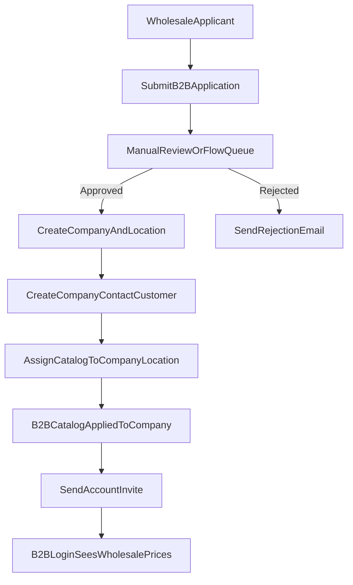

# Non-Plus B2B Registration and Catalog Plan

## Recommended Architecture

Use **one blended storefront** with two customer contexts:
- **Retail context:** normal customer accounts, retail pricing/catalog.
- **B2B context:** Shopify B2B company customers, B2B catalog pricing.

Because the store is **not on Plus**, use **B2B company + company-location catalog assignment** as the primary pricing segmentation method, with market catalogs as optional fallback segmentation.

## Capability Constraints (Important)

- Shopify B2B features are available on paid non-Plus plans, including companies and catalogs.
- Confirm current plan limits for total active catalog assignments and company-level assignments in your specific plan tier before go-live.
- **Direct company catalog assignment is available for your non-Plus setup**, so pricing can be mapped directly to company/company locations.
- Keep Shopify Markets configuration aligned so retail and B2B publishing behavior remains predictable.

## End-to-End Flow

## Registration Page Suggestions

Create a dedicated page like `/pages/wholesale-registration` with:
- Business fields: company legal name, trade license/VAT/TRN, billing/shipping addresses.
- Buyer/contact fields: full name, work email, phone, role.
- Commercial fields: expected monthly volume, product categories, requested payment terms.
- Compliance upload: trade license/reseller certificate (file upload).
- Consent: terms, privacy, pricing policy acknowledgment.

Store submissions in either:
- App backend DB (best for review workflows), or
- Shopify customer/metafields + admin tags (lighter setup).

## Approval Workflow

## 1) Intake state
- Mark each applicant with statuses: `new`, `in_review`, `approved`, `rejected`, `on_hold`.

## 2) Approval action
On approval, automate these steps:
- Create company + company location.
- Create/attach customer as company contact.
- Set B2B eligibility tags/metafields.
- Assign the B2B catalog directly to company location.
- Trigger account invite/welcome email.

## 3) Rejection action
- Send rejection email with optional reason.
- Keep record for audit + possible reapply flow.

## Catalog and Pricing Model

- Keep **Retail catalog** as default storefront.
- Create **B2B catalog** in Markets > Catalogs with wholesale prices.
- Assign this catalog directly to **company location** (primary path).
- Optionally keep market-level catalog rules for geo/channel segmentation where needed.
- Optionally use quantity rules/volume breaks for wholesale tiers.
- Use product publishing rules so B2B-only SKUs are hidden from retail.

## Theme / UX Behavior

- Show a “Wholesale apply” CTA in header/footer/account area.
- Add clear split CTAs on login/register:
  - `Retail sign up`
  - `Wholesale sign up`
- For logged-in B2B customers, show:
  - MOQ/pack-size messaging
  - case-pack increments
  - lead times and wholesale shipping policy

## Key Flows Commonly Missed

- Tax handling per B2B customer (VAT/TRN capture and exemption logic).
- Credit/payment policy (net terms approval policy and overdue handling).
- Address and multi-buyer permissions per company location.
- Fraud/risk checks for first wholesale orders.
- ERP/accounting sync for company records and receivables.
- Re-approval path when company details change.
- Offboarding/suspension flow if account becomes delinquent.

## Operational Guardrails

- Keep a manual override in admin for pricing and eligibility.
- Add audit logs for approval decisions.
- Add SLA targets (e.g., review applications within 24 business hours).
- Add fallback behavior when B2B context fails (default to retail pricing, no checkout break).

## Suggested Build Phases

1. Configure B2B catalog + sample company/customer and assign catalog to company location.
2. Build wholesale registration page and submission storage.
3. Build admin approval queue and approve/reject actions.
4. Automate company/customer provisioning + invite.
5. Add theme/account gating and B2B UX hints.
6. Run UAT for retail vs B2B pricing separation and checkout.
7. Go-live with monitoring and rollback checklist.

## No-App Implementation Option (Native Shopify First)

This option avoids third-party wholesale apps and custom backend services. It uses Shopify admin, customer accounts, company objects, catalogs, and optional Shopify Flow automations.

### What "No-App" Includes

- Separate wholesale registration page in theme (`/pages/wholesale-registration`).
- Form posts into Shopify native objects (customer + tags + notes/metafields strategy).
- Manual approval in admin (with optional Flow-assisted notifications).
- On approval, admin creates company/company location, links customer contact, and assigns B2B catalog.
- Customer gets account invite and logs in to see wholesale catalog/pricing.

### Setup Steps (No-App)

1. **Create B2B catalog**
   - In admin, create `Wholesale Catalog`.
   - Include/exclude products and set wholesale prices.
   - Add MOQ/quantity rules where needed.

2. **Create wholesale registration page**
   - Add a dedicated page template with fields:
     - company name, tax ID/VAT/TRN
     - buyer name, email, phone
     - address and business type
   - On submit, create a customer record with:
     - tag `wholesale_applied`
     - note or metafield storing submitted business details

3. **Admin review process**
   - Staff filters customers by `wholesale_applied`.
   - Validate business documents/details externally (email/phone/manual verification).
   - Move status using tags:
     - `wholesale_in_review`
     - `wholesale_approved`
     - `wholesale_rejected`

4. **Approval actions in admin**
   - Create company + company location.
   - Add the approved customer as company contact.
   - Assign `Wholesale Catalog` to the company location.
   - Remove pending tags and keep `wholesale_approved`.
   - Send account invite/reset password mail.

5. **Storefront behavior**
   - Keep retail as default experience.
   - Show “Apply for Wholesale” CTA on login/account/footer.
   - Optional: show wholesale-only navigation links only for approved B2B users.

6. **Operations and support**
   - Keep SOP for approval SLA (for example 24 business hours).
   - Use saved admin views for pending/approved/rejected applicants.
   - Maintain simple rejection/reapply email templates.

### Optional Native Automations (Still No-App)

- Use Shopify Flow to:
  - notify staff when `wholesale_applied` tag is added,
  - notify applicant when status tag changes,
  - create internal tasks/checklists for approval.

### Trade-Offs of No-App Approach

- **Pros**
  - Fastest and lowest-cost path.
  - Minimal maintenance and low technical risk.
  - Uses native Shopify B2B data model (companies/catalogs/customers).

- **Cons**
  - Approval remains partly manual.
  - Limited validation workflow and document management.
  - Less auditability and reporting versus custom app backend.
  - Harder to scale if applicant volume grows quickly.

### When to Upgrade Beyond No-App

Move to a custom app/workflow when you need:
- document upload + verification pipeline,
- role-based internal approval queues,
- ERP/CRM sync on approval,
- automated company creation with zero manual admin steps,
- advanced reporting on wholesale funnel conversion.

## Wholesale Registration Form Spec (No-App)

Use a single-page form at `/pages/wholesale-registration` and mark required fields clearly.

### Section A: Business Information

- Legal company name (required)
- Trading name / DBA (optional)
- Business type (required; distributor, restaurant, cafe, hotel, retailer, other)
- Tax registration number / VAT / TRN (required)
- Country of registration (required)
- Website or social profile (optional)

### Section B: Primary Buyer Contact

- First name (required)
- Last name (required)
- Work email (required; unique)
- Mobile number with country code (required)
- Job title/role (required)

### Section C: Purchasing Profile

- Interested categories (required; multi-select)
- Expected monthly order value (required; range select)
- Typical order frequency (required; weekly/biweekly/monthly)
- Preferred payment method (required; card/bank transfer/net terms request)
- Requested payment terms (optional; Net 7/15/30)

### Section D: Address and Logistics

- Billing address line 1 (required)
- Billing address line 2 (optional)
- City (required)
- Emirate/State (required)
- Postal code (optional if not used operationally)
- Delivery address same as billing (checkbox)
- Delivery address fields (required when checkbox is false)

### Section E: Compliance and Consent

- Trade license number (required)
- Trade license expiry date (required)
- Resale certificate available (yes/no; optional depending policy)
- Accept wholesale terms (required checkbox)
- Accept privacy policy (required checkbox)
- Marketing opt-in (optional checkbox)

### Hidden/Operational Fields

- Source page URL
- UTM source/medium/campaign
- Submitted timestamp
- Fraud honeypot field

### Validation Rules

- Block generic emails if desired (`gmail`, `yahoo`, etc.) with soft warning only.
- Enforce E.164 phone formatting where possible.
- Require VAT/TRN format checks for UAE if policy requires.
- Prevent duplicate submissions by same email within cooldown window (for example 24h).

### Customer Record Mapping (No-App)

On submit, create/update customer with:
- tags: `wholesale_applied`, `wholesale_new`
- note: serialized application snapshot (short form)
- optional customer metafields for structured data:
  - `b2b.company_name`
  - `b2b.tax_id`
  - `b2b.business_type`
  - `b2b.status` (`new`, `in_review`, `approved`, `rejected`)
  - `b2b.last_reviewed_at`

## Admin SOP (Daily Operations)

This SOP is for a no-app team process and can run entirely from Shopify admin + email.

### 1) Intake Triage (2-3 times/day)

- Open saved customer view filtered by tag `wholesale_applied`.
- Move each new record to `wholesale_in_review`.
- Verify required fields completeness.
- If incomplete, send “Need more info” template and tag `wholesale_on_hold`.

### 2) Verification Checklist

- Validate business legitimacy (license lookup/manual review).
- Validate contact identity (email domain/phone callback if needed).
- Validate tax details (TRN/VAT format and internal policy).
- Assess expected volume and fit with wholesale terms.

### 3) Approve Workflow

- Create company and company location in admin.
- Add customer as company contact.
- Assign `Wholesale Catalog` to company location.
- Set payment terms per policy (or keep prepaid initially).
- Update tags/metafields:
  - remove: `wholesale_applied`, `wholesale_in_review`, `wholesale_on_hold`
  - add: `wholesale_approved`
  - set `b2b.status=approved`
- Send approval + account activation email template.

### 4) Reject Workflow

- Update tags/metafields:
  - remove: `wholesale_in_review`
  - add: `wholesale_rejected`
  - set `b2b.status=rejected`
- Send polite rejection template (with reapply path if allowed).
- Log internal rejection reason in staff notes.

### 5) Reapply Workflow

- If rejected lead reapplies, tag `wholesale_reapplied`.
- Reopen review only after missing evidence is provided.
- Keep prior decision notes for audit trail.

### 6) Weekly QA Checklist

- Test one retail account and one approved wholesale account:
  - product visibility
  - price visibility
  - cart pricing
  - checkout pricing
- Validate newly approved accounts are linked to correct company location and catalog.
- Audit overdue `wholesale_in_review` records older than SLA.

### 7) SLA and Ownership

- Target first response: within 1 business day.
- Target final decision: within 2-3 business days.
- Assign named owner roles:
  - Sales ops: verification and decision
  - Admin ops: company/catalog mapping
  - Support: customer communication

## Ready-to-Use Email Template Subjects

- Application received: `Your Foodlink UAE wholesale application is received`
- More information required: `Additional details needed for your wholesale application`
- Approved: `Your wholesale account is approved - activate your account`
- Rejected: `Update on your wholesale account application`

## Validation Checklist

- Retail visitor never sees wholesale-only products/prices.
- Pending applicant cannot access B2B prices.
- Approved wholesale user sees correct B2B prices after login.
- Assigned catalog/pricing works in cart + checkout.
- Rejected users remain retail-only.
- Email notifications and admin logs are complete.
